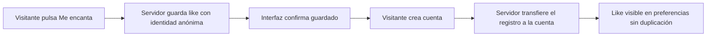

# Storyboard · ¿Por qué necesito descansar?

**Aplicación:** Osomi · Mira más de cerca.

**Versión 0.3 · 17 de septiembre de 2026.** Diseño narrativo y de interacción, derivado del Product & Experience Design Document v0.3. Público: adultos con trabajo y responsabilidades. Propuesta para revisión; todavía sin renders, assets finales ni prototipo funcional.

## 1. Dirección y reglas comunes

Una persona pasa de las demandas cotidianas a observar los ritmos de su vida y del planeta, y después a explorar el significado bíblico del descanso. La transición central es **vida cotidiana → observación → ritmo → significado**, sin presentar la astronomía como demostración de una doctrina.

El usuario mueve la historia con scroll y la detiene al dejar de desplazarse. P08b incorpora una excepción deliberada: exploración con cámara por arrastre y órbita autónoma, con pausa disponible; la aparición y alineación de fichas siguen dependiendo del scroll. Sin audio, reloj de sesión ni cuenta regresiva. GSAP controla la continuidad; Three.js explica el sistema Tierra–Sol y da forma al libro. Textos y controles permanecen legibles fuera del lienzo 3D.

«Me encanta este tema» permanece visible en una franja estable junto al acceso a fuentes. En móvil se reserva espacio para que no tape contenido ni el teclado; en diálogos se conserva dentro del área activa. Su estado pertenece al tema entero. No hay mapa libre ni botón para saltarse toda una escena.

**Convención del storyboard:** los porcentajes indican posiciones del tramo de scroll, nunca segundos ni temporizadores mostrados al visitante. Cada tramo admite detenerse y retroceder. Las respuestas y likes no se deshacen al retroceder visualmente.

**Estaciones interactivas, propuesta a probar:** el tramo termina físicamente en una actividad; el siguiente se incorpora al recorrido al pulsar «Continuar». No se intercepta la rueda para forzar respuestas. Volver, salir y consultar fuentes permanecen disponibles. Una actividad resuelta no vuelve a bloquear al revisitarla. Esta separación impide que un gesto rápido atraviese contenido posterior todavía no habilitado.

## 2. Secuencia completa

| Plano | Composición y copy propuesto | Acción | Transición al siguiente |
|---|---|---|---|
| P00 · Entrada | Fondo cálido, título «¿Por qué necesito descansar?», una figura pequeña y mucho espacio. «Explora a tu ritmo». Gratuidad y condición de registro claras. | Comenzar. Like desde aquí. | El título se desplaza y la figura ocupa el encuadre sin cortar a otra imagen. |
| P01 · Un día que no termina | Persona frontal en plano medio, con acercamiento gradual y oscilación suave no uniforme que sugiere caminar. Trabajo, mensajes, cuentas y cuidados aparecen en capas. «A veces el día termina. Las demandas, no». | Scroll determina acercamiento, balanceo y aparición de burbujas; no se anima un ciclo completo de marcha. Detenerlo congela el desarrollo. | Una burbuja se conserva y se convierte en la pregunta de P02. |
| P02 · Lo que cuesta soltar | «¿Qué te cuesta dejar en pausa?» Opciones trabajo, teléfono, responsabilidades, preocupaciones y prefiero no responder. | Elegir modifica una frase del siguiente tramo. Continuar explícito. | Las burbujas se ordenan y dejan espacio al tablero del laboratorio. |
| P03 · Laboratorio | «Una tarea, dos condiciones». Ordenar símbolos; después otra disposición equivalente con distracciones. | Empezar, actuar y comparar sin cronómetro. Teclado y pulsación. Cambiar de pestaña pausa y conserva. | Los mismos símbolos se desplazan hacia dos columnas de observación. |
| P04 · Observación | «¿Qué notaste?» Resultados reales de errores/correcciones, cuando existan. Si no hubo diferencia, decirlo. | Elegir percepción o pasar a la explicación. Alternativa guiada sin resultados personales. | Una línea del tablero se convierte en guía del esquema corporal. |
| P05 · Sueño | Diagrama conceptual y tres focos: cuerpo, aprendizaje y memoria. «Mientras duermes, tu organismo sigue trabajando». [S1 del documento principal] | Consultar puntos y evidencia. No forzar abrir todos. | Un círculo del esquema se transforma en el disco día/noche. |
| P06 · Ritmo diario | Luz y oscuridad sobre una composición sencilla. «Tu organismo tiene ritmos cercanos a 24 horas». [S2] | Explorar día y noche con control accesible. No diagnostica el reloj personal. | El círculo se convierte en el contorno de un reloj cotidiano y luego en una pregunta. |
| P07 · Tiempo con otro sentido | «Además de dormir, ¿qué significaría reservar tiempo para dejar de producir?» | Elegir relaciones, contemplación, servicio o pausa de tareas. | El contorno circular gana volumen: aparece la Tierra. |
| P08 · Día, año, semana | Secuencia Three.js detallada en §3. | Scroll aleja la cámara; después el arrastre permite explorar alrededor del Sol con órbita autónoma. Nuevo scroll introduce fichas giratorias y su alineación; estación final de reflexión. | Siete fichas se alinean como secuencia de lectura. |
| P09 · Puerta bíblica | «La Biblia da a este ritmo un significado particular. ¿Quieres explorarlo?» | Explorar perspectiva bíblica o ir al cierre. | Si acepta, las fichas se integran al relato; si no, se transforman en las opciones del cierre, sin escena doctrinal obligatoria. |
| P10 · Sábado | Lectura contextual de Génesis 2:1–3, Éxodo 20:8–11 y Marcos 2:27. «Descanso, adoración y servicio». | Abrir referencias y formular preguntas. Interpretación adventista identificada. | La séptima ficha se convierte en un marcador que acompaña el resumen. |
| P11 · Comprender | Miniquiz del documento principal, más la pregunta opcional de §3. Sin reloj ni bloqueo por nota. | Responder, revisar o continuar. Pregunta bíblica solo si vio esa sección. | Las respuestas se recogen en un resumen editorial. |
| P12 · Elegir | «¿Cómo quieres continuar?» Tres caminos, pregunta anónima y mismo like. | Seguir explorando / Explorarlo por mi cuenta / Explorarlo con alguien. | Otro tema lleva a registro; lectura abre libro; acompañamiento abre solicitud explícita. |

## 3. Escena central Three.js: del planeta a los siete días

### Lo que podemos afirmar

El día solar se relaciona con la rotación terrestre respecto al Sol. No conviene rotular un giro de 360° respecto a las estrellas como exactamente 24 horas: el día sideral dura aproximadamente 23 h 56 min. El año corresponde aproximadamente al recorrido orbital de la Tierra alrededor del Sol. [A1, A2]

La semana no corresponde a una vuelta terrestre u orbital de siete días. Su historia no debe presentarse como exclusivamente bíblica: la investigación de UCL identifica las tradiciones de la semana del sábado y la semana planetaria. [H1] No usamos «sin fundamento científico», «es la única unidad sin fenómeno natural» ni «siempre igual en todo el mundo» como premisas.

### P08a · Un día — primer tramo

**Entrada:** el contorno de P07 se vuelve una esfera terrestre con iluminación lateral. Eje y marcador de superficie discretos; fondo sin estrellas decorativas en movimiento. La luz mantiene una dirección comprensible.

**0–20 %:** mostrar la Tierra y el texto «El día tiene un ritmo que podemos observar».

**20–75 %:** el scroll hace avanzar la rotación y el pequeño desplazamiento orbital necesario para representar el retorno del marcador a la misma orientación respecto al Sol. La cámara conserva el eje visual. No se introduce un contador.

**75–100 %:** texto «La rotación de la Tierra se relaciona con la alternancia entre día y noche». Etiqueta «Día solar medio: aproximadamente 24 horas». Un desplegable opcional aclara día solar y sideral; no se recita toda esa precisión en el titular. [A1]

**Al parar:** se detiene la esfera, la cámara y la iluminación narrativa. **Al volver:** el movimiento revierte; ninguna elección cambia.

### P08b · Un año — segundo tramo

**Revelar:** la cámara se aleja con el scroll manteniendo la Tierra como referencia. El Sol entra en el encuadre y aparece el trazo orbital. Texto: «Un año sigue otro recorrido».

**Explorar:** al terminar el alejamiento, la Tierra continúa recorriendo su órbita sin necesidad de scroll. El usuario puede arrastrar para mover la cámara alrededor del Sol; no arrastra la Tierra ni cambia su trayectoria. Se permite explorar sin un tiempo máximo ni esperar una vuelta completa. La vista incluye «Una vuelta alrededor del Sol: aproximadamente 365¼ días». [A2]

**Aviso inferior, escritorio:** «Arrastra para cambiar de perspectiva. Sigue bajando para continuar».

**Aviso inferior, móvil:** «Desliza a los lados para explorar. Desliza hacia arriba para continuar». Propuesta: reservar gesto horizontal para cámara y vertical para scroll; añadir controles de perspectiva para teclado y para quienes prefieran no arrastrar. No pedir un gesto de dos dedos ni apropiarse del gesto de zoom del navegador.

**Controles discretos:** pausar/reanudar órbita y restablecer vista. Cámara centrada en el Sol con límites para no atravesarlo ni perder el conjunto. Sin zoom de rueda: rueda y trackpad continúan la historia. El arrastre es rotación de cámara, no una operación de soltar objetos en destinos.

Se informa «Tamaños, distancias y velocidad simplificados». A esta escala se omite el detalle de rotación axial para no sugerir una rotación por año ni mostrar cientos de giros rápidos. El trazo es una curva de longitud limitada, no una acumulación infinita de geometría.

En móvil, Sol y órbita ocupan la parte superior; copy y aviso debajo, sin solaparse con like y controles. No se comprime la composición de escritorio.

### P08c · ¿Y la semana? — tercer tramo

**Retomar con scroll:** la Tierra sigue orbitando mientras el desplazamiento introduce siete fichas numeradas que también giran alrededor del Sol como transición visual. Desde la primera ficha aparece «Calendario · representación visual»; aspecto de hojas o tarjetas, nunca de planetas. La pregunta: «¿Y por qué agrupamos los días de siete en siete?».

Las fichas se incorporan a una banda gráfica separada del trazo orbital terrestre. Su cantidad y su entrada dependen del scroll; sus posiciones circulares se animan sin representar una proporción física entre una vuelta y una semana. Las caras permanecen legibles. Esta coreografía es una metáfora editorial, no una simulación de una órbita semanal.

**Alinear:** al seguir bajando, la cámara pasa suavemente desde el ángulo elegido por el usuario a la composición de lectura; se desactiva el arrastre durante esa transición. Las fichas salen de la banda circular y forman una secuencia de calendario. La Tierra pierde protagonismo y su movimiento autónomo se detiene al abandonar el plano astronómico. En móvil las siete fichas se disponen en dos filas si no caben legibles en una sola.

Copy: «La semana organiza nuestros días de otra manera: su historia incluye tradiciones culturales y religiosas». Acceso «Historia de la semana» con H1. No se iguala el tiempo de la órbita animada a siete días.

**Al detener el scroll en este tramo:** se detiene la entrada y alineación de fichas; la órbita autónoma puede continuar mientras el sistema siga visible y no esté pausado. Esta excepción se anuncia con el control de pausa. Al abrir evidencia, ocultar la pestaña o salir de la escena se suspende el movimiento autónomo.

La secuencia termina en la estación «Medimos el paso del tiempo. ¿Qué significado queremos darle?». «Continuar» conduce a P09. Solo después de aceptar la perspectiva bíblica se destaca la séptima ficha como descanso en ese relato.

**Volver hacia arriba:** se deshace la alineación sin desaparecer fichas de golpe. Al regresar al área de exploración se habilita de nuevo el arrastre. Se conserva la preferencia de pausa y la última orientación libre; su recuperación es gradual. La fase orbital puede continuar desde su posición conservada: no se promete una repetición idéntica al píxel de una escena que usa tiempo autónomo.

### P10 · Transformación bíblica de las fichas

Las fichas 1–6 se agrupan; la séptima adquiere espacio propio y una etiqueta de descanso. Acompañar con referencias y la interpretación declarada del relato de creación, sin fingir una simulación científica de la creación. La luz, el tamaño o el color no sustituyen el texto.

Pregunta de comprensión opcional: «¿Qué mostró esta escena?» Respuesta: diferencia entre movimientos astronómicos y un ritmo de calendario al que la tradición bíblica da significado. No se pide aceptar una creencia para acertar.

## 4. Interacción y accesibilidad del laboratorio

La versión principal permite seleccionar símbolos y destinos con clic, tacto o teclado. No exige arrastrar, responder deprisa ni tolerar flashes. Antes de la segunda ronda se explica que habrá distractores. El estado de la ronda permanece al cambiar de pestaña.

La alternativa propuesta muestra un ejemplo en pasos elegidos por el visitante: tarea inicial → interrupción → regreso a la tarea → explicación de lo que debe recordarse. Conserva el objetivo de comprensión, no asegura la misma experiencia sensorial. No genera puntuación ni un resultado atribuido al visitante.

En la estación se distinguen «Realizar la actividad», «Ver un ejemplo paso a paso» y una salida explícita si la persona no quiere participar. Ninguna de esas opciones se activa mediante scroll. Texto y orden finales se validarán en el prototipo, especialmente para evitar sensación de examen obligatorio.

## 5. Libro Three.js: lectura y notas

**Entrada desde P12:** una referencia del resumen permanece en pantalla y se convierte en marcador del libro. La cubierta aparece en perspectiva; «Abrir» activa una apertura breve que acaba en una vista frontal estable. No necesita sonido ni movimiento constante.

**Composición de escritorio:** páginas en el centro y panel de notas fuera del texto. **Móvil:** una página legible a la vez; notas en una vista alterna, sin comprimir dos páginas y un panel en el ancho de un teléfono.

**Contenido inicial:** índice del tema, resumen, fuentes científicas, textos bíblicos verificados y preguntas para reflexionar. Citas literales pendientes de selección de traducción y revisión; no se generan imágenes con versículos incrustados.

**Controles:** anterior, siguiente, índice, añadir nota y cerrar. Los gestos son complementarios. La lectura, selección, enlaces y edición usan elementos de interfaz normales coordinados con Three.js. No se pinta el editor como textura dentro del canvas.

**Notas:** propuesta vigente: borrador temporal sin cuenta y guardado persistente en servidor con cuenta. Informar de la condición antes de escribir; al guardar, mostrar pendiente/guardado/error según respuesta real. El texto nunca pasa a analítica. Registrarse para guardar conserva el borrador durante el flujo; no prometer conservarlo tras cerrar la pestaña sin guardarlo.

**Alternativa plana:** mismo índice, texto y notas sin apertura 3D. **Retorno:** cerrar restaura P12, foco y like; abrir otra vez no obliga a repetir la introducción. La vista plana no omite contenido.

## 6. Like anónimo → preferencia de usuario

Requisito confirmado: persistir el like en base de datos incluso sin registro. Al registrarse desde la sesión anónima se asigna ese mismo registro al usuario y se refleja en sus preferencias.

La cookie propia contiene una referencia opaca de identidad; el like vive en servidor. No guarda progreso local. El servidor verifica la sesión que reclama el registro. No se enlazan preguntas anónimas ni textos privados por compartir dispositivo.

**Estados visibles:** sin marcar → guardando → marcado; al desmarcar, guardando → sin marcar. Si falla, mantener la intención pendiente con opción de reintento y mensaje breve; no anunciar guardado exitoso. El like no bloquea la narrativa.

**Reglas para el futuro PRD:** una preferencia efectiva por identidad y tema; operación de transferencia atómica e idempotente; preservar ID cuando no hay conflicto; si la cuenta ya tiene preferencia, consolidar sin duplicar y conservar referencia del registro fusionado. Propuesta de conflicto: gana la última elección explícita según el servidor, incluso si desmarca. El cambio de propietario no es otro like y no aumenta totales. Tras transferir, revocar la posibilidad de reclamar de nuevo ese registro con la identidad anónima.

**Límite:** antes de registrarse, borrar la cookie o cambiar de dispositivo puede perder el vínculo con el registro anónimo. La persistencia en base de datos no permite identificar mágicamente a la persona. No se utiliza fingerprinting. La asociación de preferencias es independiente del consentimiento de medición de navegación.

## 7. Manifiesto inicial de producción

| Asset | Entregable | Uso y validación |
|---|---|---|
| HUM-01 | Recorte frontal en plano medio con margen de encuadre, fondo y burbujas independientes | P01–P02. Zoom y oscilación suave ligados al scroll; sin rig ni ciclo de piernas. Revisar bordes y rostro en móvil. |
| LAB-01 | Símbolos vectoriales, focos y estados | P03–P04. Legibles sin color, compatibles con controles nativos. |
| SUE-01 | Esquema corporal conceptual | P05. Revisión de contenido; no pretende representar mediciones clínicas. |
| AST-01 | Esfera terrestre, textura con procedencia/licencia, material solar, eje, marcador y órbita | P08. Tierra y Sol reconocibles; iluminación coherente; escala simplificada declarada. |
| CAL-01 | Siete fichas editoriales numeradas | P08–P10. Separar claramente calendario de órbita. |
| LIB-01 | Cubierta, páginas y materiales del libro | Lectura. Texto fuera de texturas y versión plana utilizable. |
| UI-01 | Like, fuentes, estados de guardado y navegación | Presencia estable; no oculta copy ni actividades. |

No se han generado estos assets todavía. Primero se fijan encuadres y dimensiones mediante wireframes; después se producen capas compatibles, evitando ilustraciones completas imposibles de animar por separado.

**Sesión de producción pendiente, solicitada por el propietario:** generar las imágenes de las capas con **GPT Image 2.5**. Verificar el modelo disponible antes de iniciar y no sustituirlo sin consultar. Detalle en [Estado de desarrollo](estado-desarrollo.md#sesión-pendiente-de-generación-de-imágenes).

## 8. Pruebas previstas para el prototipo

| Caso | Resultado que debe verificarse |
|---|---|
| Detener scroll en cada tramo | Narrativa y cámara se detienen; solo en P08b/c la órbita autónoma continúa si está visible y no pausada. |
| Scroll muy rápido, avance de página o gesto largo | La estación no desaparece sin elección; el visitante puede volver y salir. |
| Retroceder tras responder | Mantiene respuestas, like y ronda; no repite efectos de envío. |
| Cambiar pestaña durante actividad | Retoma mismo estado, sin reiniciar ni sumar tiempo fuera de vista. |
| Movimiento reducido y teclado | Mismos conceptos, estaciones y opciones; sin atrapamiento de foco. |
| Fallo de WebGL o textura | Secuencia estática equivalente de día/año/calendario; libro plano conserva lectura y notas. |
| Like anónimo, recargar con misma identidad | Estado recuperado desde servidor; una sola preferencia efectiva. |
| Like anónimo y registro exitoso | Mismo registro vinculado a la cuenta y visible en preferencias; total sin incremento. |
| Reintento de transferencia o solicitudes simultáneas | Sin duplicación ni apropiación de registros de otra sesión. |
| Preferencia previa en cuenta | Regla de consolidación aplicada una sola vez y estado coherente. |
| Desmarcar antes de registrarse | La cuenta no recibe un favorito activo antiguo. |
| Red caída al marcar | Interfaz informa pendiente/error y permite reintentar. |
| Explicación por el visitante | Distingue astronomía, historia del calendario y perspectiva bíblica. |

Son criterios propuestos, no pruebas ejecutadas. El siguiente artefacto será el wireframe visual de P01→P03 y P08→P10 para revisar composición y continuidad antes de generar assets finales o programar.

## 9. Fuentes de esta ampliación

- **A1:** [NASA — Reference Systems](https://science.nasa.gov/learn/basics-of-space-flight/chapter2-1/). Diferencia entre día sideral y solar.
- **A2:** [NASA — Facts About Earth](https://science.nasa.gov/earth/facts/). Rotación y recorrido orbital terrestre; cifras aproximadas para divulgación.
- **H1:** [UCL — The seven-day week in the Roman Empire and the Near East](https://www.ucl.ac.uk/arts-humanities/hebrew-jewish/hjs-research/research-projects-hjs/calendars-late-antiquity-and-middle-ages-standardization-and-fixation/seven-day-week-roman-empire-and-near-east). Investigación de las tradiciones bíblica y planetaria, difusión y estandarización. Esta fuente orienta la cautela histórica; no se convierte una hipótesis de origen en certeza absoluta.

Consultadas el 17 de septiembre de 2026. Las fuentes de sueño y doctrina permanecen en el documento principal; la edición bíblica definitiva sigue pendiente de selección y revisión.

## 10. Referencia incorporada: Storycomet

[Storycomet](https://storycomet.app/) se incorpora como referencia de objeto-libro, descubrimiento y elementos animados. La página pública describe libros infantiles interactivos con escenas 3D. El propietario destaca la estantería y reporta lentitud al interactuar. La inspección del navegador llegó a la carga del libro y la vista se cerró: no se completó una revisión visual ni una medición de rendimiento. La atribución de su creación a GPT-6 Astra procede del propietario y no se verificó.

**Adaptación propuesta para una fase posterior:** biblioteca editorial para adultos, con niveles de estantes agrupados por afinidad temática. Ejemplos provisionales: cuerpo y descanso; relaciones y vida cotidiana; sentido y esperanza. Los estantes son agrupaciones de navegación del grafo, no niveles de dificultad o de avance espiritual. Un tema puede relacionarse con varios estantes sin duplicar su identidad o progreso. Mantener conexiones entre libros de distintos estantes y ofrecer también una lista legible.

No se añade la biblioteca al piloto ni se copia la estética infantil. La posible edición para niños queda como referencia futura independiente. El libro de lectura ya previsto sí puede beneficiarse de la continuidad visual entre cubierta, apertura y contenido.

**Rendimiento como criterio de diseño:** no asumir que todos los libros de una estantería necesitan modelos 3D vivos. Proponer cubiertas 2D o relieve sencillo para el catálogo y cargar el objeto interactivo al abrirlo; mantener solo la escena activa, liberar recursos al cerrarla y evitar movimiento continuo cuando nada cambia. Son decisiones a validar, no una explicación comprobada de la lentitud de Storycomet. El prototipo debe medir carga, respuesta a controles y fluidez en un móvil representativo antes de ampliar la escena.

## 11. Apertura revisada: caminar sugerido en plano medio

La propuesta del propietario sustituye el ciclo completo de marcha. Encuadre de torso y cabeza orientados hacia el visitante; piernas fuera de campo. El personaje se acerca mediante escala moderada y desplazamiento hacia cámara. Una oscilación vertical pequeña, un balanceo lateral menor y ligeras variaciones de inclinación sugieren pasos. El fondo avanza a otra velocidad para dar profundidad.

El movimiento no uniforme se diseña como una curva suave y repetible vinculada a la posición del scroll, no como ruido aleatorio recalculado. Detener el scroll congela la composición y retroceder recupera el mismo encuadre. No se aplica temblor al texto, al like ni a los controles. Limitar amplitud y zoom para que la cara no se deforme y los bordes del recorte nunca entren en pantalla.

La trayectoria exacta y su amplitud se decidirán visualmente en el prototipo. Riesgos a observar: parecer una fotografía flotante, balanceo de mareo o zoom excesivo. En movimiento reducido se conservan los hitos narrativos y las burbujas, con el personaje estable. El paso a P02 mantiene una burbuja como ancla visual mientras se detiene el acercamiento.

## 12. Contrato de interacción P08 y siguiente prototipo

**Actualización aprobada · 22 de septiembre de 2026:** prevalece la coreografía del prototipo aceptado por el propietario. La órbita autónoma empieza durante el alejamiento, sin retroceder con el scroll. Los textos usan fundidos sutiles. Las siete tarjetas salen una por una desde detrás del Sol, recorren un arco elíptico y ocupan directamente su posición final. Esto sustituye las menciones anteriores a fichas giratorias o banda orbital. La geometría sigue siendo provisional. Próxima integración: P09, con elección explícita antes de destacar la séptima ficha y mostrar P10.

Se aplicaron las skills GSAP ScrollTrigger y GSAP Timeline para separar la secuencia controlada por desplazamiento del movimiento autónomo. El primer prototipo local está implementado en `/prototipo/p08` (21 de septiembre de 2026); evidencia y pruebas pendientes en `estado-desarrollo.md`.

| Estado | Cámara | Tierra y fichas | Salida |
|---|---|---|---|
| Revelación | Controlada por scroll | Mostrar sistema astronómico | Llegar al encuadre amplio |
| Exploración | Controlada por arrastre o controles accesibles | Tierra orbita autónomamente; sin fichas | Seguir bajando |
| Aparición de fichas | Mantiene orientación de exploración | Tierra y banda de fichas en movimiento; cantidad revelada por scroll | Seguir bajando hacia alineación |
| Alineación | Transición de scroll desde orientación capturada | Las fichas salen hacia posiciones de lectura; órbita se retira | Alcanzar calendario |
| Calendario | Encuadre estable | Fichas estáticas; render autónomo suspendido | Continuar a P09 o retroceder |

Un solo controlador escribe la cámara a la vez. Al pasar a alineación, se captura la orientación actual y se interpola hacia el encuadre editorial con el progreso de scroll. No activar simultáneamente arrastre y timeline sobre la misma cámara. Una pausa manual permanece vigente al cruzar estados. Al ocultar pestaña se conserva la fase orbital y no se recupera el tiempo transcurrido mediante un salto.

En movimiento reducido no se inicia órbita automática: controles permiten explorar vistas y pasos; aparecen las mismas siete fichas y explicaciones. Pausar no impide continuar con scroll. Los controles no exigen arrastre y el canvas no bloquea el desplazamiento vertical.

**Pruebas nuevas:** arrastrar sin mover la página en escritorio; desplazamiento vertical libre en móvil; rueda sobre canvas continúa la historia; salir sin completar una órbita; retomar scroll desde varios ángulos sin salto de cámara; pausa respetada en transición; vueltas prolongadas sin crecimiento del trazo; fichas leídas como calendario y no como cuerpos físicos; preferencia de movimiento reducido respetada.

**Siguiente pieza acotada:** prototipo de P08 con geometría sencilla — Sol, Tierra, órbita y siete tarjetas — para validar el cambio entre arrastre y scroll antes de producir texturas finales. El prototipo deberá mostrar esta coreografía y sus alternativas, sin cuentas, base de datos ni otras escenas.

### Decisión posterior de acceso · 18 de septiembre de 2026

Prevalece el PRD revisado: acceso directo con las librerías oficiales de Supabase y RPC, sin ORM externo; autenticación con correo y Google. Se retira cualquier propuesta anterior de alias/contraseña y recuperación mediante código descargable. Modalidad propuesta para correo: OTP de un solo uso sin contraseña. Ver `acceso-datos-autenticacion-v0.1.md`.
