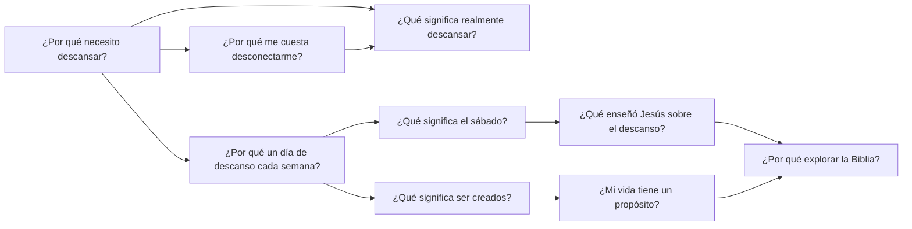

# Product & Experience Design Document
## Proyecto evangelístico interactivo · Piloto «¿Por qué necesito descansar?»

**Versión:** 0.1 · 16 de septiembre de 2026 · **Estado:** primera propuesta para revisión conjunta.

Este documento define la experiencia que queremos construir antes de convertirla en requisitos de software. No es el PRD ni afirma que el producto esté implementado o probado. El nombre público del proyecto queda abierto.

**Base de continuidad:** conversación «Idea para evangelizar digitalmente», del proyecto de Religión, recuperada directamente, y encargo actual. Las decisiones expresas del usuario se distinguen de las propuestas de esta versión. Las fuentes externas consultadas se enumeran en §8.

## 1. Intención de producto

Construir una plataforma gratuita de descubrimiento que reciba a personas por sus preguntas cotidianas y les permita explorar evidencia, experimentar, reflexionar y conocer la perspectiva bíblica adventista. El encuentro con una persona real es una continuación voluntaria de esa exploración.

La unidad del producto es una **experiencia interactiva de descubrimiento**. Cada una entrega una respuesta útil y abre nuevas preguntas. El conjunto forma un grafo: existen múltiples entradas y recorridos, no una única secuencia de lecciones.

**Promesa editorial propuesta:** «Explora una pregunta real. Prueba, contrasta las fuentes y forma tu propia conclusión».

**Transformación deseada del piloto:** pasar de «descansar es lo que hago cuando ya no puedo más» a considerar el descanso como parte valiosa de la vida, comprender algunas bases del sueño y descubrir qué propone la Biblia sobre el sábado. La persona puede comprender la propuesta sin estar de acuerdo con ella.

El propósito evangelístico es explícito en la información del proyecto. La entrada narrativa comienza con una necesidad humana; la perspectiva bíblica se introduce cuando corresponde y se identifica como tal. La plataforma no se presenta como institución científica ni como iniciativa oficial de la Iglesia si esa relación no existe.

## 2. Decisiones heredadas y propuestas

| Estado | Decisión |
|---|---|
| Acordado | Documental interactivo + storytelling editorial + museo científico digital + juego. |
| Acordado | Experiencias conectadas mediante un grafo de preguntas. |
| Acordado | Evidencia verificable y experimentos seguidos de explicación. |
| Acordado | Introducción progresiva de principios bíblicos desde la perspectiva adventista. |
| Acordado | Primera experiencia completa sin cuenta; registro para continuar con otra experiencia. |
| Acordado | Progreso persistente en servidor, no guardado localmente. |
| Acordado | «Me encanta este tema», «Tengo una pregunta» anónima y tres caminos de continuidad. |
| Acordado | Contacto voluntario posterior con una persona real; país y ciudad no son datos iniciales necesarios. |
| Acordado | Acceso gratuito, sin venta de cursos o productos. |
| Acordado | GSAP como motor principal; Three.js solo cuando el volumen o el espacio expliquen mejor el contenido. |
| Acordado en esta conversación | Diseñar inicialmente para adultos con trabajo y responsabilidades; primera versión en español. |
| Propuesto | Piloto de 8–12 minutos, ampliable mediante fuentes y lecturas opcionales. La duración se validará. |
| Propuesto | Cuenta con alias y contraseña, sin correo obligatorio; código de recuperación descargable. |
| Propuesto | Preguntas anónimas mediante buzón privado con código de consulta independiente de la cuenta. |
| Propuesto | Piloto sin 3D: ilustración por capas, diagramas y controles 2D son suficientes para la hipótesis inicial. |

## 3. Público, necesidades y límites

La audiencia inicial confirmada son adultos con trabajo y responsabilidades. Como hipótesis de diseño, pensamos en una persona curiosa, con poco tiempo, familiarizada con interfaces móviles y sin interés previo necesario en estudios bíblicos. Puede ser creyente, escéptica o indiferente. El diseño debe funcionar sin conocimiento religioso.

Sus necesidades son entender algo que le afecta, probar sin sentirse examinada, saber de dónde sale una afirmación y decidir qué compartir. No se le asigna una creencia, un diagnóstico o una disposición espiritual por sus clics.

Se diseña primero para móvil y se amplía a escritorio. El ritmo respeta responsabilidades reales: trabajo por turnos, cuidado de familiares y situaciones que dificultan parar. No se usa culpa por no poder descansar ni se promete que una práctica espiritual resolverá una condición médica.

El piloto trata educación y reflexión. No prescribe tratamientos, mide cortisol ni diagnostica agotamiento. No necesita preguntas sobre historia clínica. Un lanzamiento dirigido a menores requeriría un diseño específico de privacidad y acompañamiento; no se presupone resuelto en esta versión.

## 4. Forma de la experiencia

### Enfoques considerados

| Enfoque | Ventaja | Coste o limitación |
|---|---|---|
| **Capítulos interactivos con avance voluntario — recomendado** | Integra escenas, experimentos y pausas de lectura; se adapta bien al móvil. | Requiere cuidar las transiciones para que no parezca una presentación estática. |
| Documental de scroll continuo | Gran continuidad visual y sensación editorial. | El desplazamiento puede competir con controles, lectura y accesibilidad. |
| Museo con mapa libre desde el inicio | Refuerza descubrimiento y autonomía. | Puede desorientar antes de comprender la propuesta y eleva el coste del piloto. |

La propuesta combina capítulos dentro de cada experiencia y libertad entre experiencias. El scroll puede revelar elementos dentro de una escena; un botón claro permite pasar a la siguiente. El mapa completo no es necesario para navegar: las recomendaciones en forma de preguntas son la interfaz inicial del grafo.

### Gramática repetible

**Pregunta → escena → acción → observación → explicación → evidencia → reflexión → nueva pregunta.**

No todas las escenas requieren todos los pasos. Cada interacción debe cambiar la comprensión o la decisión del visitante. El juego aporta ensayo, descubrimiento y feedback; no premios por aceptar una creencia, rachas de obediencia o rankings religiosos.

La primera experiencia se puede terminar, leer con sus fuentes y repetir sin registrarse. En su cierre se ofrece registro; se exige al intentar iniciar otra experiencia. Consultar evidencias, revisar el contenido actual, preguntar o pedir contacto no exige terminar el quiz ni crear cuenta.

### Contrato de navegación

- Siempre disponibles: volver, avanzar cuando haya contenido listo, pausar movimiento, sonido opcional, fuentes y ayuda.
- Las animaciones no bloquean la lectura: «Mostrar escena completa» permite omitirlas. No hay avance automático mientras se lee.
- Los experimentos se pueden omitir y tienen una explicación equivalente accesible.
- Salir de la pestaña pausa animación, audio, cronómetro y tiempo activo. Volver no produce un salto de escenas.
- El resumen final se alcanza tanto con perspectiva bíblica explorada como con esa sección omitida; ambos recorridos son válidos y se distinguen al medir.

## 5. Piloto: guion de experiencia

**Pregunta:** ¿Por qué necesito descansar?

**Idea narrativa:** la vida acumula demandas; detenerse permite observarlas. A partir de esa pausa se explora el sueño, los límites de una demostración interactiva y la posibilidad de reservar tiempo con un sentido distinto de producir. Finalmente se presenta la propuesta bíblica del sábado.

**Arco emocional:** reconocimiento → curiosidad → descubrimiento → comprensión → reflexión → libertad de elección.

Los textos siguientes son copy propuesto. Las afirmaciones científicas se limitan a la evidencia identificada; el guion final necesita revisión editorial y bíblica.

| Escena | Texto y propósito | Acción, respuesta y salida | Recursos |
|---|---|---|---|
| 00 · La pregunta | «¿Por qué necesito descansar?» / «Una experiencia para detenerte, descubrir y hacer preguntas». Aviso: primera experiencia sin cuenta; cuenta gratuita para seguir con otros temas. | «Comenzar». Acceso visible a «Sobre este proyecto» con su perspectiva cristiana adventista. | Título editorial, fondo sencillo, duración orientativa, sonido apagado. |
| 01 · Todo sigue | Persona caminando; aparecen trabajo, mensajes, cuentas y cuidados. «A veces tu día termina, pero las demandas siguen». | «Pausa» congela las capas. Alternativa sin movimiento muestra ambas composiciones. «Continuar» no exige esperar un loop. | Fondo, personaje, sombras y burbujas separados; GSAP. No usar mensajes privados reales. |
| 02 · Lo que cuesta soltar | «¿Qué te cuesta más dejar en pausa?» Trabajo / teléfono / responsabilidades / preocupaciones / prefiero no responder. | La elección cambia una frase y los objetos de la escena siguiente. No cambia la doctrina ni calcula un perfil psicológico. | Selección simple, texto editable fuera de la imagen. |
| 03 · Pequeño laboratorio | «Prueba una tarea breve en dos condiciones». Etiqueta: demostración educativa, no prueba clínica. | Ordenar cuatro símbolos en dos rondas: una tranquila y otra con distracciones visuales. Mostrar tiempo y errores reales, sin garantizar qué ronda será mejor. «Omitir» disponible. | Objetos pulsables; sin arrastrar como única alternativa. Detalle del protocolo en §6. |
| 04 · Mirar el resultado | «¿Qué cambió para ti?» Si no hubo diferencia o mejoró: reconocerlo expresamente. | Explicar práctica, azar, orden y dispositivo como posibles influencias. No convertir un resultado individual en prueba sobre salud. | Comparación descriptiva; sin percentiles ni clasificación de personas. |
| 05 · Mientras duermes | «Dormir participa en procesos que sostienen tu salud, aprendizaje y memoria». [S1] | Explorar tres puntos de un diagrama: cuerpo, aprendizaje y memoria. Cada punto abre explicación breve y «Ver evidencia». | Diagrama 2D conceptual; no simula un cerebro medido. |
| 06 · Un ritmo diario | «Tu organismo tiene ritmos cercanos a 24 horas; la luz y la oscuridad ayudan a sincronizarlos». [S2] | Mover un control día/noche cambia la iluminación y las etiquetas. Se explica que es un esquema, no una predicción personal. | Cielo y reloj 2D; no inventar gráficas hormonales. |
| 07 · Otra pregunta | «Además de dormir, ¿qué significaría reservar tiempo para dejar de producir?» | Elegir una intención: relaciones, contemplación, servicio o pausa de tareas. Esto introduce una reflexión de vida, no una conclusión clínica. | La composición deja espacio; desaparecen burbujas sin prometer alivio terapéutico. |
| 08 · La perspectiva bíblica | «La Biblia propone un ritmo de actividad y descanso. ¿Quieres explorar esa perspectiva?» | «Explorar la perspectiva bíblica» o «Ir al cierre». Presentación explícita de Génesis 2:1–3, Éxodo 20:8–11 y Marcos 2:27 en contexto. | Tres bloques de lectura, comparación de ideas y referencias; traducción por definir antes de publicar. |
| 09 · El sábado | «Desde la perspectiva adventista, el sábado es el séptimo día dedicado al descanso, la adoración y el servicio». [B1] | Explorar los tres sentidos; destacar relación con Dios y con otros. No reducirlo a una técnica de productividad ni afirmar que la ciencia demuestra el día. | Composición editorial con espacio, luz y relaciones humanas. |
| 10 · Lo que descubriste | Miniquiz de comprensión y reflexión libre. | Tres preguntas base y una bíblica solo si se exploró esa sección. Feedback inmediato; ninguna nota bloquea el cierre. | Controles claros, explicación tras cada respuesta, opción de revisar. |
| 11 · Tu siguiente pregunta | «¿Cómo quieres continuar?» | «Me encanta este tema»; «Tengo una pregunta»; los tres caminos de §9. Registro después de completar, al iniciar otra experiencia. | Resumen, próximas preguntas y ruta de retorno. |

### Miniquiz propuesto

1. **¿Qué puede demostrar esta actividad de dos rondas?** Respuesta: cómo te fue en esas condiciones de juego; no diagnostica tu salud. Distractores: mide estrés clínico / demuestra cuánto necesitas dormir.
2. **¿Los ritmos circadianos describen principalmente un ciclo cercano a…?** 24 horas / siete días / un mes. Feedback apoyado en S2.
3. **¿Qué diferencia hay entre consultar evidencia y hacer una reflexión personal?** La primera sustenta afirmaciones verificables; la segunda explora su significado para tu vida. No son intercambiables.
4. **Si se exploró la sección bíblica: ¿cómo presenta esta experiencia el sábado adventista?** Descanso, adoración y servicio / exclusivamente dormir más / técnica para trabajar más. Feedback apoyado en B1.

La reflexión «¿Qué quisieras explorar ahora?» no tiene respuesta correcta. La puntuación, si se muestra, describe comprensión del contenido presentado; nunca fe o aceptación.

## 6. Protocolo del experimento interactivo

**Objetivo de diseño:** dar material para observar la propia interacción y conversar sobre atención. En esta versión no se afirma un efecto científico general de las interrupciones: falta seleccionar y revisar investigación específica antes de incorporar esa afirmación.

Dos rondas con tareas de dificultad equivalente. Antes de empezar, una práctica sin puntaje. El orden de las condiciones se alternará entre sesiones para reducir un sesgo de orden; esto no convierte la actividad en un estudio controlado. Las distracciones son elementos ficticios de la interfaz, no notificaciones del sistema.

Se registran tiempos y errores únicamente mientras la pestaña está activa y la ronda en curso. Si hay cambio de pestaña, se ofrece reiniciar la ronda y se marca el intento interrumpido como no comparable. No se muestran resultados inventados si el usuario omite o abandona.

El resultado admite: mejor con distracción, peor con distracción, parecido e incompleto. En todos los casos se explica la limitación. El efecto de práctica, dispositivo y accesibilidad impide convertirlo en diagnóstico o comparación entre personas.

**Alternativa accesible:** observar un ejemplo explicado paso a paso, sin cronómetro. Se marca como alternativa, no como fracaso. Los resultados precisos de la tarea no necesitan persistir asociados a una cuenta para medir uso del módulo.

## 7. Grafo inicial de contenidos

Los nodos son experiencias con una pregunta central. Las aristas expresan por qué una pregunta conduce a otra. Las conexiones editoriales no equivalen a demostraciones científicas o lógicas.

Solo D forma parte del piloto completo. Los demás nodos son propuestas editoriales, no contenidos publicados. «¿Por qué un día de descanso cada semana?» aborda el marco bíblico y cultural; no presupone un reloj biológico semanal demostrado.

Cada nodo tendrá identificador estable, pregunta, resumen, tipo de contenido, versión, fuentes, estado editorial y conexiones justificadas. Una arista incluye pregunta de enlace, motivo, prioridad y disponibilidad del destino. La primera recomendación puede apoyarse en una elección explícita del usuario; el piloto no necesita un algoritmo de perfilado.

Al finalizar, mostrar como máximo tres preguntas disponibles, con «Te puede interesar porque…». El mapa completo será una vista opcional futura. Si un nodo aún no existe, se identifica como próximo y no se ofrece un botón que finja iniciarlo.

**Limitación del piloto de un solo nodo:** permite evaluar comprensión y deseo declarado de continuar, pero no prueba recorridos reales ni retención entre temas. Para esa validación se producirá un segundo nodo breve, editorialmente completo, antes de evaluar la expansión.

## 8. Evidencia, Biblia y gobierno editorial

### Tres niveles visibles

**Evidencia científica:** qué se observó, en quiénes, con qué limitaciones. **Reflexión:** preguntas y analogías para interpretar la vida. **Perspectiva bíblica adventista:** lectura de textos y explicación doctrinal identificada. La interfaz usa etiquetas y lenguaje, además de color, para distinguirlas.

Una fuente científica sobre sueño no respalda por extensión todas las afirmaciones sobre descanso, estrés, semana laboral o sábado. Las analogías visuales tampoco cuentan como evidencia.

### Registro inicial de afirmaciones

| ID | Afirmación utilizable | Fuente y estado | Límite editorial |
|---|---|---|---|
| S1 | El sueño contribuye a salud, aprendizaje y memoria. | [NHLBI: Why Is Sleep Important?](https://www.nhlbi.nih.gov/health/sleep/why-sleep-important), consultado para esta versión. Fuente institucional de síntesis. | No atribuirle una cifra o efecto no verificado; no equivale a diagnóstico individual. |
| S2 | Los ritmos circadianos siguen ciclos cercanos a 24 horas y reciben señales ambientales. | [NHLBI: Your Sleep/Wake Cycle](https://www.nhlbi.nih.gov/health/sleep/sleep-wake-cycle), consultado para esta versión. | No transformarlo en evidencia de un ciclo semanal obligatorio. |
| E1 | El visitante obtuvo cierto resultado en dos condiciones del juego. | Observación generada por la interacción; pendiente de implementación. | Solo describe la sesión. El juego no es un experimento clínico validado. |
| B1 | La creencia adventista del sábado incluye séptimo día, descanso, adoración y servicio. | [Conferencia General: creencia fundamental 20](https://gc.adventist.org/beliefs/), consultada para esta versión. | Es una fuente doctrinal, no científica. |
| B2 | Génesis 2:1–3, Éxodo 20:8–11 y Marcos 2:27 forman el conjunto inicial de lectura bíblica. | Referencias seleccionadas; falta fijar traducción y revisar los pasajes completos para el guion final. | No publicar citas literales antes de verificar texto, contexto y permiso de uso de la traducción. |

Quedan fuera de la versión inicial: porcentajes de mejora no investigados, curvas de cortisol inventadas, supuestos beneficios exclusivos del sábado demostrados científicamente y afirmaciones de que el juego prueba una doctrina.

### Ficha de evidencia y publicación

«Ver evidencia» abre un panel con la afirmación exacta, fuente enlazada, tipo de evidencia, resumen comprensible, población o alcance cuando aplique, limitaciones, fecha de revisión y responsable. Para cifras y relaciones causales se buscará el estudio original y se verificará el diseño; no basta con un titular.

Flujo editorial: borrador → comprobación de fuentes → revisión científica o temática → revisión bíblica adventista → revisión de claridad y accesibilidad → publicación versionada. Una fuente retirada o una corrección importante marca las escenas afectadas para revisión. No hay revisores humanos designados todavía; el documento no atribuye aprobaciones inexistentes.

## 9. Continuidad y relación humana

| Acción exacta | Qué significa | Comportamiento propuesto |
|---|---|---|
| **Seguir explorando** | Entrar en otra experiencia guiada. | Ver próximas preguntas; al iniciar un destino disponible, registro o inicio de sesión. Retornar al destino elegido tras autenticarse. |
| **Explorarlo por mi cuenta** | Leer fuentes y pasajes de este tema sin acompañamiento. | Abrir un cuaderno de lectura del tema actual, sin cuenta. Si desde ahí se inicia otra experiencia, aplica el mismo registro. |
| **Explorarlo con alguien** | Solicitar conversación con una persona real. | Explicar que es un instructor bíblico o colaborador adventista y pedir un canal de contacto elegido. No confundir envío con conversación realizada. |
| **Me encanta este tema** | Expresar interés explícito en el tema. | Activación reversible; no suscribe ni solicita contacto. Una elección vigente por usuario y tema; anónimos se reportan aparte. |
| **Tengo una pregunta** | Enviar una inquietud sin identidad. | Buzón privado independiente. Respuesta consultable con código, sin publicación automática ni vínculo con la cuenta. |

### Registro y recuperación

La propuesta inicial respeta la preferencia por pocos datos: alias y contraseña. Un código de recuperación se entrega al crear la cuenta; sin él ni canal adicional no puede prometerse recuperación. El PRD evaluará esta opción frente a correo con enlace de acceso, que reduce la gestión de contraseñas pero pide un dato personal adicional.

Cuenta, consentimiento para analítica opcional y autorización de contacto son decisiones separadas. Registrarse no autoriza mensajes de seguimiento. No se solicitan país, ciudad ni teléfono en el registro.

El progreso se guarda en servidor para usuarios identificados. Durante la primera visita, el estado de pantalla vive temporalmente en memoria; no se escribe progreso en almacenamiento local. Una cookie de sesión no es un archivo de progreso. Si se acepta medición previa al registro, se usa un identificador temporal de sesión; al registrarse, la vinculación se explica al usuario. Sin esa medición no se reconstruye retroactivamente su recorrido.

Sin cuenta ni identificador persistente no es posible reconocer de forma fiable a la misma persona al regresar. La regla «una experiencia sin cuenta» es una barrera de continuidad dentro del flujo, no una promesa de impedir que un visitante anónimo abra otra sesión. No se usará fingerprinting para resolverlo.

### Preguntas anónimas

Al enviar se entrega un código secreto y un enlace privado para volver al buzón. El visitante debe conservarlos; no se guardan localmente como progreso. Si se pierden, no se promete recuperar el hilo anónimo. No se pide email para responder.

El texto no se une al identificador de cuenta ni al historial de navegación. «Anónima» significa sin identidad solicitada o asociada por el producto; la explicación no promete invisibilidad técnica absoluta frente al alojamiento. Los registros operativos deben minimizarse y no incorporar el contenido a herramientas generales de analítica.

Las preguntas pasan por una cola de moderación y respuesta humana. Una pregunta no se publica en una biblioteca pública sin autorización adicional. No se promete respuesta inmediata; los tiempos se mostrarán cuando exista un equipo y una capacidad real.

### Contacto humano

Antes del envío: indicar quién atenderá, gratuidad, finalidad, canal y permiso explícito para usarlo. Solicitar solo el dato correspondiente al canal elegido; horario o zona horaria, cuando sean necesarios para coordinar. La ubicación se pregunta más adelante únicamente si la persona solicita una iglesia cercana.

Estados: solicitada → recibida → asignada → primer contacto intentado → conversación realizada → cerrada o cancelada. Cada estado debe basarse en un hecho registrado. El usuario puede cancelar. Si no hay personas disponibles, se comunica la indisponibilidad y se ofrece la pregunta anónima o lectura individual; no se finge una conversación en vivo.

## 10. Dirección visual, movimiento y assets

**Dirección propuesta: museo editorial de la vida cotidiana.** Escenas humanas concretas, tipografía legible, diagramas precisos y espacio para observar. La apertura puede ser más densa; al pulsar pausa se reorganiza, sin flashes ni aceleraciones agresivas. La sección bíblica mantiene el mismo lenguaje visual para preservar continuidad.

Paleta preliminar: tinta profunda, fondo cálido claro y acentos azul y ámbar con funciones consistentes. El significado no depende del color. Tipografía de lectura sobria combinada con títulos editoriales. No se fija marca, logo ni familia tipográfica antes de explorar composiciones.

### Inventario de assets del piloto

| Paquete | Capas y entregables previstos | Criterio de aceptación |
|---|---|---|
| A01 · Cotidiano | Fondo sin personaje; personaje aislado; sombra; burbujas de trabajo, mensajes, cuentas y cuidados; composiciones móvil y escritorio. | Encuadres compatibles, transparencia limpia, estilo e iluminación consistentes. |
| A02 · Laboratorio | Símbolos, distractores, estados y feedback como elementos editables. | Reconocibles sin color; operables con teclado y tacto. |
| A03 · Sueño | Esquema conceptual, indicadores y rótulos separados. | No aparenta datos clínicos reales ni exactitud anatómica no revisada. |
| A04 · Día/noche | Fondo, luz y disco de ciclo diario separados. | La animación conserva la explicación al quedar estática. |
| A05 · Lectura bíblica | Composición editorial, referencias y texto nativo. | El texto se selecciona, amplía y lee con tecnologías de apoyo. |
| A06 · Cierre | Miniaturas de próximos temas y estados disponibles/próximos. | No anuncia como terminado un nodo aún no publicado. |

Imágenes generadas son materia prima artística, nunca fotografías documentales o evidencia científica. Cada asset tendrá ID, escena, autoría/origen, permisos de uso, dimensiones, variante, descripción accesible y versión. Los textos, cifras y controles permanecerán fuera del bitmap.

Para caminar de verdad se necesitan poses o un personaje articulado; desplazar una imagen rígida no equivale a un ciclo de marcha. El storyboard definirá esa opción antes de generar el paquete. Los fondos y personajes se componen con una guía común de cámara y escala.

GSAP orquesta entradas, transiciones, pausas, loops discretos y secuencias ligadas al scroll. La navegación conserva su propio estado para que un fallo de animación no bloquee el contenido. Three.js solo se incorpora si manipular profundidad, volumen o perspectiva permite entender algo que el 2D no explica; debe incluir alternativa estática y justificar su coste de carga. No hay una necesidad identificada en este piloto.

## 11. Accesibilidad y comportamiento técnico deseado

Son criterios de diseño para desarrollar en el PRD, no afirmaciones de cumplimiento ya comprobado.

- Lectura completa con movimiento reducido, sonido apagado y teclado. Sin depender exclusivamente de hover, arrastre o velocidad.
- Orden de lectura estable, foco visible, retorno de foco al cerrar fuentes y aviso comprensible al cambiar de escena.
- Botones táctiles de al menos 44 × 44 píxeles CSS como objetivo del producto; contraste y ampliación de texto verificables.
- Toda narración futura tiene transcripción; los sonidos no transportan información indispensable.
- Primero cargar texto, controles y una composición ligera. Precargar solo lo necesario para próximas escenas; no descargar todo el museo de entrada.
- Si un asset o animación falla, mostrar contenido estático y permitir avanzar. Los formularios fallidos conservan el texto en memoria mientras la pestaña siga abierta y permiten reintentar sin duplicar envíos.
- Separar contenido versionado, estados de recorrido, animación, cuentas, analítica y atención humana. No se decide todavía framework, base de datos o proveedor.

## 12. Medición de interés y aprendizaje

La pregunta principal es: **¿la experiencia ayuda a comprender y provoca exploración voluntaria?** Tiempo y clics aportan señales de uso, no miden fe, conversión espiritual ni compromiso religioso por sí solos.

| Señal | Definición propuesta | Precaución de interpretación |
|---|---|---|
| Inicio | Sesión que activa «Comenzar». | Una carga de página no cuenta como inicio. |
| Cierre alcanzado | Sesiones que llegan al resumen / sesiones iniciadas. | Separar recorrido bíblico visto u omitido; llegar no prueba comprensión. |
| Uso del experimento | Inicio, finalización u omisión por sesión. | Omitir por accesibilidad no indica desinterés. |
| Comprensión | Respuestas iniciales y revisión posterior por pregunta. | No exigir acuerdo doctrinal; no mezclar intentos. |
| Interés explícito | Usuarios con «Me encanta» activo / usuarios expuestos a ese control. | Reportar anónimos por sesión, no como personas únicas. No interpretar ausencia de clic como rechazo. |
| Continuidad | Usuarios que inician otro nodo / usuarios expuestos a destinos publicados. | Requiere al menos un segundo nodo. |
| Registro | Cuentas creadas / sesiones que vieron la invitación. | Desglosar cancelación y fallo; una cuenta no es contacto autorizado. |
| Retorno | Usuarios registrados que vuelven en 7 y 30 días. | Cohortes con ventana cumplida; anónimos no deduplicables. |
| Preguntas | Cantidad de envíos recibidos y temas agregados. | Texto fuera de analítica; no asociar al historial individual. |
| Acompañamiento | Solicitudes recibidas, asignadas y conversaciones realizadas. | Son hechos diferentes; el clic no prueba envío ni conversación. |

Vocabulario inicial de eventos: `experience_started`, `scene_viewed`, `experiment_started`, `experiment_completed`, `experiment_skipped`, `evidence_opened`, `biblical_perspective_selected`, `experience_completed`, `topic_love_changed`, `registration_prompt_viewed`, `registration_completed`, `next_experience_started`, `contact_request_received`.

Cada evento de recorrido incluye solo los campos necesarios: versión de experiencia, escena, momento, sesión y usuario interno cuando corresponda. El tiempo activo excluye pestaña oculta y periodos sin actividad según un umbral a fijar y validar en el PRD. La finalización se deduplica por sesión y versión. Envíos y registros se cuentan tras confirmación del servidor.

Las preguntas anónimas se cuentan desde su sistema separado, sin el sobre de identidad del recorrido. No enviar correos, teléfonos, contraseñas, códigos privados o textos libres a analítica. No construir una puntuación de «probabilidad de conversión religiosa».

No se fijan todavía metas porcentuales de crecimiento: falta una línea base. Comparar versiones deberá controlar cambios de fuente de tráfico, dispositivo y contenido. La mejora de un indicador no justifica debilitar evidencia o presionar al usuario.

## 13. Validación y alcance

### Qué debe demostrar el primer piloto

1. Una persona entiende cómo avanzar, omitir movimiento y consultar fuentes.
2. La pausa y el pequeño laboratorio aportan comprensión, no solo espectáculo.
3. Distingue una observación del juego, evidencia científica y una enseñanza bíblica.
4. Reconoce que la iniciativa es gratuita y puede elegir sin aceptar contacto.
5. Comprende por qué aparece el registro después de la primera experiencia.
6. Puede formular una pregunta o solicitar acompañamiento sin confundir ambas acciones.

Propuesta de investigación: 5–8 adultos que no hayan participado en el diseño, con distintas familiaridades religiosas y dispositivos. Observar tareas, pedir que expliquen con sus propias palabras y registrar dónde se detienen. Es una evaluación formativa, no una muestra representativa ni prueba estadística de efectividad evangelística.

**Tareas:** comenzar y pausar; completar u omitir el experimento; encontrar una fuente; explicar el límite del juego; entrar o saltar la sección bíblica; elegir continuación; consultar una respuesta con código; distinguir registro de contacto. Probar inicialmente las pantallas de contacto con datos ficticios, sin enviar mensajes reales.

**Criterios de revisión:** si una persona cree que el juego diagnostica su salud o que la ciencia demuestra el sábado, revisar el guion antes de publicar. Si no puede terminar con movimiento reducido o teclado, corregir la interacción. Los objetivos numéricos de usabilidad y rendimiento se concretarán tras el primer prototipo y la selección de dispositivos.

### Secuencia de entregables

| Etapa | Entregable concreto | Qué permite decidir |
|---|---|---|
| 1 · Ahora | Este documento fundacional v0.1. | Intención, experiencia y acuerdos que guiarán el trabajo. |
| 2 · Diseño del piloto | Storyboard por pantalla, copy final, matriz de afirmaciones revisadas, wireframes móvil/escritorio y manifiesto de assets. | Si el recorrido funciona editorial y visualmente. |
| 3 · PRD del MVP | Requisitos, estados, límites, criterios de aceptación y alcance de operación humana. | Qué construir y cómo verificarlo. |
| 4 · Prototipo visual | Escenas representativas de apertura, laboratorio, evidencia, transición bíblica y cierre. | Ritmo, legibilidad, carga y comprensión con personas reales. |
| 5 · Implementación | Piloto, cuentas, persistencia, buzón y solicitud humana según alcance aprobado. | Validación funcional completa y lanzamiento controlado. |
| 6 · Expansión | Segundo nodo publicable y primeras conexiones. | Continuidad real y aprendizaje entre experiencias. |

Quedan fuera del primer piloto: plataforma 3D completa, red social, chat de IA que sustituya instructores, mapa de todas las doctrinas, localización automática de iglesias, campañas automáticas de contacto y un sistema de recomendación complejo.

## 14. Decisiones abiertas para el siguiente ciclo

Las siguientes decisiones no impiden revisar este documento; sí condicionan entregables posteriores:

| Decisión | Propuesta actual | Momento de resolver |
|---|---|---|
| Contextos dentro del público confirmado | Incluir empleo, cuidados y trabajo por turnos sin asumir una jornada uniforme. | Afinar los ejemplos durante el storyboard. |
| Cuenta mínima | Alias y contraseña con recuperación por código. | Antes del PRD de autenticación; comparar con email y enlace. |
| Profundidad bíblica del piloto | Introducir sábado y su sentido; desarrollar preguntas doctrinales posteriores en otros nodos. | Durante revisión del guion. |
| Traducción bíblica | Seleccionar texto verificable con permiso de uso adecuado. | Antes de incorporar citas a los assets o al producto. |
| Responsables humanos | Propietario coordina revisores e instructores; nombres y capacidad aún sin designar. | Antes de prometer respuesta o abrir contacto real. |
| Nombre y marca | Sin nombre público confirmado. | Tras validar dirección visual; no bloquea el storyboard. |
| Retención y eliminación de datos | Minimizar datos y separar cuenta, analítica, preguntas y contacto. Plazos exactos pendientes. | Antes de recoger datos reales y redactar avisos definitivos. |

## 15. Forma de colaboración

El asistente produce borradores, investigación con fuentes, guiones, diagramas, diseños, assets, código y pruebas; mantiene cada entregable editable y distingue lo propuesto de lo verificado. El propietario decide propósito y prioridades, revisa el tono y coordina a las personas que validarán contenido y atenderán a visitantes. No necesita traer todo el contenido ya escrito.

Cada ciclo termina con un artefacto concreto y una decisión acotada. La próxima pieza propuesta es el storyboard del piloto, empezando por apertura, pausa y laboratorio para fijar el lenguaje de la experiencia. El PRD se deriva del diseño revisado; no sustituye este trabajo.

**Estado de esta entrega:** concepto consolidado, guion inicial, grafo propuesto, modelo de continuidad, inventario de assets y plan de validación documentados. Fuentes S1, S2 y B1 consultadas. No hay assets finales, código del producto, pruebas con usuarios ni aprobación editorial humana todavía.
